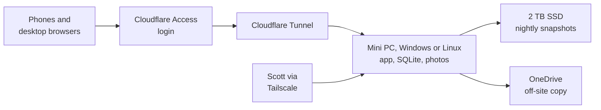

# Construction Tracker Build Plan

2026-09-17 · @Someone

## Summary

The tracker is one responsive web app on a mini PC at the company's premises, reached through Cloudflare Tunnel and Access, with SQLite and photos on local disk and two nightly backups. This plan covers infrastructure only so far. The data model, photos, notifications and the two sides come in later rounds.

The server only makes outbound connections, so no ports are opened and it has no public address. Everything here is proposed and changes if the open questions at the end come back differently.

## Test stage: GitHub Pages

The first test runs on GitHub Pages as a clickable front end with made-up data, before any server exists. Pages only serves static files, so there is no database, no login and no server code at this stage.

- **Fake data only:** a Pages site is public to anyone with the link, even when the repository is private. No real addresses, prices, holding costs or photos go in. Use invented jobs like "12 Example St". (Superseded 18 Sep 2026: real sites, approvals and trades are in by request; prices, contract sums, real phone numbers and emails still stay out. See README "What's real".)
- **What it can test:** the phone and desktop layouts, the Monday screen, the Gantt and look-ahead, the waiting-on list, and installing to the home screen, since Pages serves HTTPS.
- **What it can't test:** shared data between people, roles, photo uploads that persist, push reminders and backups. Each person's changes stay in their own browser.
- **Build it so nothing is thrown away:** the front end is a static single-page app that reads and writes through one data layer. On Pages that layer is a mock holding seed data in the browser. On the real server the same layer calls the API, and the box serves the same static files.
- **Address will change:** Pages serves from a github.io sub-path. Home-screen installs from the test get redone once the real domain exists, so only Scott and Dominic need to install the test version.
- **Private alternative:** Cloudflare Pages behind Cloudflare Access is also free, keeps the test private, and doubles as the iPhone login test listed under Access and login.

## Access and login

Cloudflare Tunnel plus Access keeps the app private without a VPN app on anyone's phone. Cloudflare handles the login, and the app only maps a verified email to a role and a side.

- **Login methods:** people in the company's Microsoft tenant sign in with Microsoft. Anyone outside it gets a one-time code by email, which fits the brief's "whatever email address they like".
- **Roles table:** the app still holds a small table of email, role and side. This is what keeps prices away from Alec and keeps the two sides separate.
- **Cost:** Cloudflare's free plan covers up to 50 users ([source](https://www.cloudflare.com/plans/zero-trust-services/)).
- **Tailscale:** kept on the server for Scott's remote maintenance only. Users never install it.
- **Test first:** put a bare test page behind Access and install it to an iPhone home screen before building on it. Home-screen web apps can behave oddly when the Cloudflare session expires.

| Option considered | Why not |
| --- | --- |
| Tailscale for everyone | Every phone needs the VPN app left on. The free plan allows 6 users and is meant for non-commercial use; paid is $8 per user a month ([source](https://tailscale.com/docs/account/manage-plans/free-plans-discounts)). |
| Supabase | Data leaves their server. Free projects pause after a week of inactivity, so it would need Pro at $25 a month ([source](https://supabase.com/pricing)). Still the fallback if on-premises turns out not to matter. |
| Microsoft sign-in built into the app | Free, but Scott writes and maintains the login code, and people outside the tenant need guest accounts. |

## The server

One small always-on box runs everything: the app, the SQLite database and the photo folder. It may be Windows or Linux, so every piece is chosen to run the same on both.

- **Hardware:** a mini PC on wired ethernet, with the BIOS set to power on after an outage.
- **Power:** a small UPS, mainly so a power flicker doesn't corrupt a write.
- **Internet:** any ordinary NBN plan works, since only outbound connections are needed. If the office connection drops, the app is down for everyone, including Alec on site. Accept that for the test build and consider 4G failover later.
- **Stack:** one app process, SQLite, and photos in a folder on disk. No separate database server.
- **No Docker:** Docker on Windows needs WSL2 and a logged-in user, which is fragile on an unattended box. The app runs natively instead, as a Windows service or a systemd service on Linux.
- **Starts on boot without a login:** on Windows the app, cloudflared and Tailscale all run as services, so a Windows Update restart at 3am brings everything back by itself.
- **Scheduling inside the app:** reminders and the nightly backup run from the app's own scheduler, not cron or Task Scheduler, so there is one code path for both systems.
- **Portable code:** file paths are built with the language's path library, never hard-coded slashes, and photo file names are treated as case-insensitive.
- **Windows settings:** sleep and hibernate off, and Windows Update active hours set so restarts happen overnight.
- **Updates:** automatic security updates on either system.
- **Deploys and remote access:** Scott reaches the box over Tailscale. On Linux that is Tailscale SSH. Tailscale SSH is understood not to run on Windows, so there it is Windows' built-in OpenSSH server or Remote Desktop over Tailscale. A deploy is one script on either system.

## Backup

The server backs up nightly to a 2 TB SSD beside it, and a second encrypted copy goes off-site. The SSD covers a dead disk, a bad update or an accidental delete. The off-site copy covers theft, fire, a power surge or ransomware taking both at once. The hold-point photos are certifier evidence, so they need both layers.

1. **Nightly snapshots to the SSD with restic.** Dated snapshots allow a rollback to last Tuesday. A plain file copy would overwrite the good copy with the broken one.
2. **Snapshot the database first.** Use SQLite's built-in backup command to write a clean copy, then back that up. Copying the live file while the app runs can produce a corrupt backup.
3. **Nightly off-site copy.** rclone pushes the encrypted restic backup to OneDrive in the Microsoft tenant at no extra cost. Backblaze B2 is the alternative at a few dollars a month.
4. **"Last backup" on Dominic's admin screen.** It turns red if no backup has succeeded in 48 hours.
5. **One test restore before go-live.** Restore onto a laptop and open the app.

The backup also includes the push notification keys and the app's configuration, not just the database and photos. restic, rclone and SQLite's backup command all run on Windows and Linux, so the backup steps are the same on either.

## Decide before building

These five are expensive to change once phones are set up, so they get settled first.

- [ ] **Pick the domain once.** Cloudflare Tunnel needs a domain on Cloudflare's DNS, registered in the company's name. Home-screen installs and push subscriptions are tied to the exact address, so changing it later means redoing every phone.
- [ ] **Verify Cloudflare's signed token on every request.** The app listens only on localhost and checks the token, not just the email header. Otherwise anyone on the office Wi-Fi could reach the app directly and pose as Dominic.
- [ ] **Generate the push notification keys once and store them.** Web push uses one key pair. Losing it means every phone has to re-subscribe, so it goes in the backup and the password manager.
- [ ] **Put every account in the company's name.** Cloudflare, the domain and the off-site backup sit under a company email, with logins in a shared password manager.
- [ ] **Write a one-page runbook.** How to restart the box, deploy, restore a backup and add a person, so the app keeps running when Scott is away.

## Running it

These are cheap to add and each one prevents a silent failure.

- **Uptime alert:** a free external check messages Scott when the site stops responding. Otherwise the first report comes from Dom on Monday morning.
- **Reminder scheduling:** reminders run from the app's own scheduler, set to Sydney time. If the box was off at the send time, it sends the missed reminders on restart.
- **Photo handling:** phone photos are several MB each. Keep the originals, generate thumbnails on the server, and make uploads resumable so the brief's retry on bad reception works.
- **Upload size:** Cloudflare's free plan is understood to cap a single upload at about 100 MB. That's fine for photos but would block long videos. Confirm the limit before go-live.
- **Outbound email:** version one needs none, because Cloudflare sends its own login codes. Version two emails invoices to Dom's sister, which can go through the Microsoft tenant.

## Desktop and phone

It is one web app with a responsive layout, not two builds. The same address opens in a desktop browser and installs to the home screen on a phone.

| Screen | Phone | Desktop |
| --- | --- | --- |
| Gantt and three-week look-ahead | A simplified list of steps by week | The full Gantt, with drag to change durations |
| Template, stage and category editing | View only, or basic edits | Dominic's main workspace |
| Waiting-on list and call list | The primary view, built for ticking off one-handed | The same list with more columns and filters |
| Photo upload and daily note | The primary view for Alec and Raff | Viewing and sorting photos |
| Monday screen | Stacked cards, one per job | The table as written in the brief |

Phone screens get designed first for Alec, Raff and the partners, and desktop screens first for Dominic. The Gantt editor is the most expensive screen, so version one ships desktop-only editing with a read-only phone view.

## Open questions

The plan assumes on-premises hosting is a firm requirement and that Raff and Alec sit outside the Microsoft tenant. Neither is confirmed yet.

- [ ] Why do they want it on their own server: data on their premises, cost, or general privacy? If it isn't a firm requirement, Supabase Pro is less work and safer for the photos.
- [ ] Do Raff and Alec have accounts in the Microsoft tenant, or only Dominic, Dom and Norm?
- [ ] What is the server today: an existing always-on machine, a NAS, or something to buy, and does it run Windows or Linux? Who is near it when it needs a restart?
- [ ] Will Dom and Norm open the Monday screen on a laptop or only on their phones? This decides whether the table or the phone cards get priority.
- [ ] How many hours a month is Scott willing to spend on maintenance once it's live?
- [ ] Version one is described as tracking only, but the Monday screen shows holding cost and Alec must never see a price. Which dollar figures are in version one?

## Next rounds

Infrastructure is covered; the data model is next, because most of the build effort sits there.

1. **Data model and forecast logic:** how the program creates waiting-on items, how shipment ETAs move them, and how forecast finish and weekly slip get calculated.
2. **Photos:** categories per stage, hold-point gating and storage growth.
3. **Notifications:** push reminders, the call list and the freshness flag.
4. **The two sides:** keeping Norm's Eastwood jobs separate from day one.

## Sources

- [Zero Trust plans and pricing, Cloudflare](https://www.cloudflare.com/plans/zero-trust-services/)
- [Free pricing plans and discounts, Tailscale Docs](https://tailscale.com/docs/account/manage-plans/free-plans-discounts)
- [Pricing and fees, Supabase](https://supabase.com/pricing)
